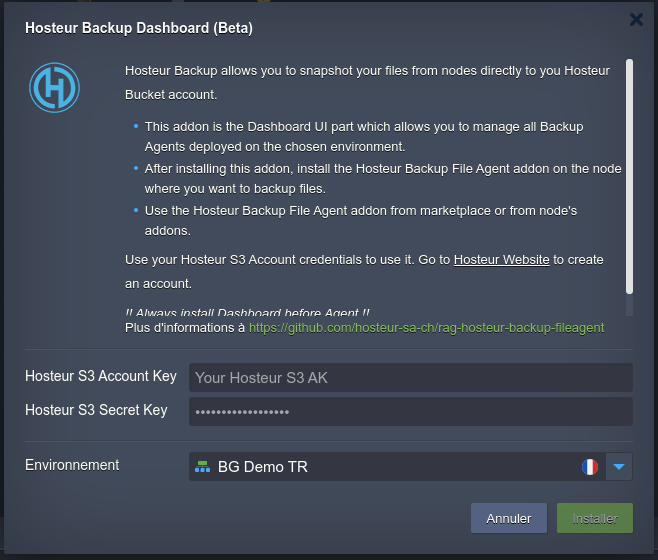
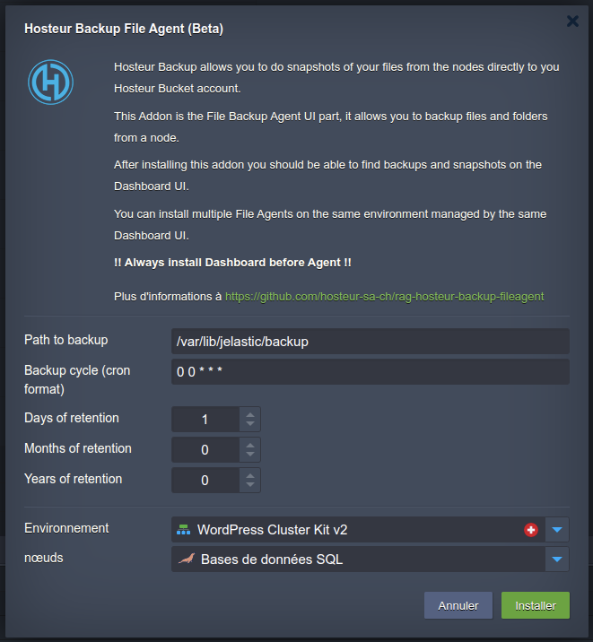
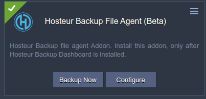

# Hosteur Backup for Ragnarokkr (beta)

>[french version](README_fr.md)

>JPS Package for Hosteur Backup Dashboard

## How to install Hosteur Backup for Ragnarøkkr

1. Verify if you already have Hosteur Bucket Service, or Go to [Hosteur](https://www.hosteur.com/business/stockage/bucket) to create your account.
2. Go to your Ragnarøkkr [dashboard](https://app.rag-control.hosteur.com/)
3. In the marketplace search for Hosteur Backup Dashboard Addon
4. Select the environment you want to deploy the service to 
5. From the marketplace or directly from the nodes look for the Hosteur Backup File Agent Addon and install it on the node you want to backup.
6. Open your Dashboard (All informations are sent by email after installation)

*You can install several agents per environment, all of which will be managed by the same dashboard.*

**!! Always Install Hosteur Backup Dashboard Addon before deploying agents !!**

>You don't have a Hosteur Bucket account yet… Go to [Hosteur](https://www.hosteur.com/business/stockage/bucket) to create your account.

*Hosteur Bucket is a standard Bucket S3 service, hosted by Hosteur and natively replicated on 2 of our Datacenters (France and Switzerland)*

## Documentation

### Dashboard Installation

From Marketplace choose Addon : Hosteur Backup Dashboard (beta)

**Type here the S3 credentials of your Hosteur Bucket account and choose the environment you want to backup.**

>The login information will be sent to you by email and displayed at the end of the installation.

Hosteur Backup Dashboard is always accessible in TLS from the node fqdn at : https://nodexxxx-env-xxxx.rag-cloud.hosteur.com:8443/

>**!! Backup Encryption Keys : This key is the encryption key of your backups in AES-256 format, you must keep it in order to be able to use your backups, the loss of this key will not allow you to use them anymore !!**

>If you open the interface before you have installed an agent you will get an error message indicating this.

#### Dashboard Interface

##### The home page displays the list of connected agents and the snapshots associated with that agent.

>There are two types of snaphosts, named "Scheduled" or "Manual", corresponding to the type of backup.

##### By opening an Agent's details you will see the available snapshots, statistics and a search tool to find file or folder occurrences in your backups.

##### By opening a snaphot, you will see a list of your backed up files and folders, as well as a search engine to find file and folder occurrences in your backups.

##### If you search for a file or folder, you will see a list of occurrences of your search for all files or folders in your backups, by date

##### "Restore All" or "Restore Selected", allows you to restore files and folders selected in the backup_restore path, this path is available from the Dashboard node but also on the Agent nodes, you will find a restore date folder containing your backups.

>UI restore path

>Agent restore path

You can access the restore logs from the dashboard home page.

### File Agent Installation

From the Marketplace choose the Addon: Hosteur Backup Files Agent (beta)

On a Compute Node (App)

On a SQL Node

>For SQL Node you need to activate Database Backup first [documentation](https://www.virtuozzo.com/application-platform-docs/database-backups/)

**Here you need to configure witch path to backup, the backup period (in Cron format, use a generator [here](https://crontab-generator.org/) if needed), then the retention of the backups in days, months, years (set to 0 to disable the retention), the minimal retention should be 1 days, 0 months and 0 years in order to keep only one backup copy per day.**

>You can install as many agents as you want per node in the environment. 
>**Hosteur Backup File Agent** is compatible with all native nodes of the platform, as well as with Docker images under certain conditions, detailed here.

>For a Docker image to be compatible it must contain at least :
>* curl
>* tar
>* Linux Kernel amd64

#### File Agent Features

By default the File Agent will perform snapshot backups, at 00:00, on 1 rolling day, but you can change this using the **Configure** button in the addon. You can find them on the interface named as **Scheduled**.

You can also start a manual backup at any time with the **Backup Now** button. You can find these backups on the interface named as **Manual**.