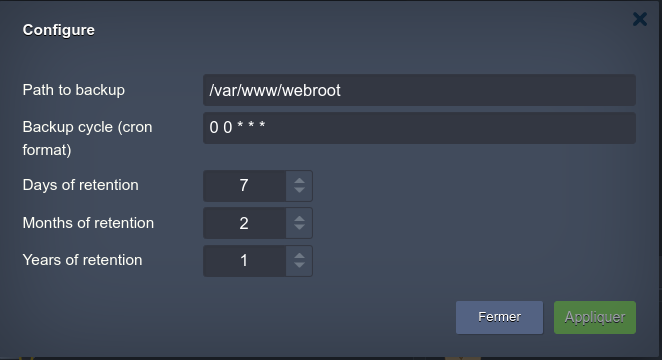

# Hosteur Backup for Ragnarokkr (beta)

>JPS Package for Hosteur Backup Dashboard

## How to install Hosteur Backup for Ragnarokkr

1. Verify if you already have Hosteure Bucket Service, or Go to [Hosteur](https://www.hosteur.com/business/stockage/bucket) to create your account.
2. Go to your Ragnarokkr [dashboard](https://app.rag-control.hosteur.com/)
3. From the marketplace search for Addon Hosteur Backup Dashboard
4. Choose your environment to deploy service to
5. From the marketplace or directly from nodes, search for Addon Hosteur Backup File Agent and deploy it on node you want to backup files to.
6. Open your Dashboard (All informations are send by email after installation)

*You can have multiple Agent on same environment, managed by the same dashboard.*

**Always Install Dashboard Addon before deploying agent.**

>No Hosteur Bucket Account yet ...
>Go to [Hosteur](https://www.hosteur.com/business/stockage/bucket) to create your account.

## Documentation

### Dashboard Installation

From Marketplace choose Addon : Hosteur Backup Dashboard (beta)

**Here place your Hosteur Bucket S3 credentials, and select the environment to backup**

Credentials informations will be send to your email, and displayed at the end of addon's installation.

Hosteur Backup Dashboard is always accessible over TLS at node fqdn like : https://nodexxxx-env-xxxx.rag-cloud.hosteur.com:8443/

>If you open UI at this time you should get error message because you haven't deployed agent yet.

#### Dashboard UI

##### Home start with all agent list with current snapshots

>You can have here 2 types of snapshots, Scheduled or Manual, relative to backup mode.

##### Open Node details, get you snapshots, statistics and a search tool to find a files or forlder from backups.

##### Open a snapshots, get you files and folders inside it and a search tool to find a files or forlder from backups.

##### Search for a file or folder, get all pathes and versions who can be restored.

##### Restore All or Selected, give you choice to restore files, folders on restore_backup path, this path is accessible at de restoration date on UI node and Agents nodes at the same path.

>UI restore path

>Agent restore path

Also you can get *Restore log* at Home UI to keed a look on restoration opérations

### File Agent Installation

From Marketplace choose Addon : Hosteur Backup Files Agent (beta)

On Compute Node

On SQL Node

**Here you need to configure witch path to backup, when (cron format use generator [here](https://crontab-generator.org/) if you needed to), and backups retention in Days, Months and Years (values can be 0 to disable retention), minimal retention should be 1 days, 0 months, 0 years to keep only one backup copy**

>You can installed as many agent you want on any nodes.
>**Hosteur Backup File Agent** is compatible with all current native node, or docker image with some restriction listed below.
>To be compatible Docker's images should have already deployed :
>* curl
>* tar
>* Linux Kernel amd64

#### File Agent features

By default File Agent will be backup by snapshots, backup path at 00h00 everyday, keeping X days, but you can change it by using **Configure** button on installed Addon from the node.

You can also start a manual backup at any time with the **Backup Now** button. you can find them on UI name **Manual**.