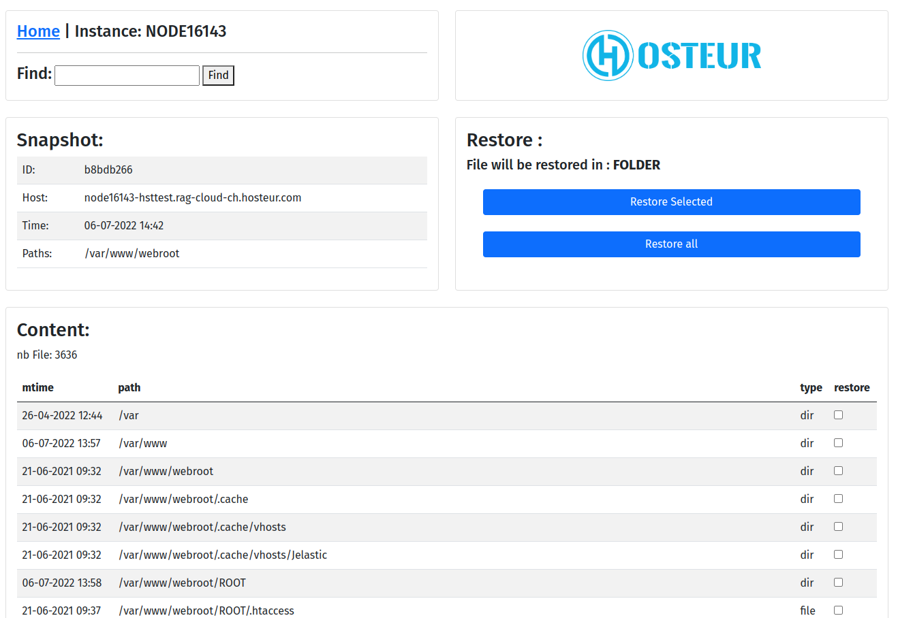
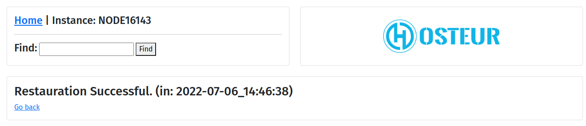
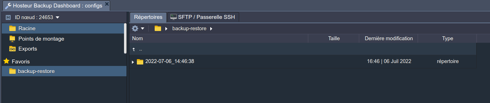
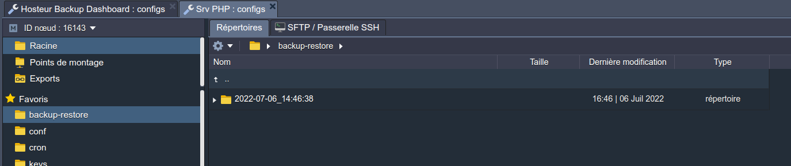

# Hosteur Backup for Ragnarokkr (beta)

>[english version](README.md)

>Package JPS pour Hosteur Backup Dashboard

## Comment installer Hosteur Backup for Ragnarokkr

1. Vérifier que vous avez souscrit au service Hosteure Bucket, ou rendez-vous sur [Hosteur](https://www.hosteur.com/business/stockage/bucket) pour créer un compte.
2. Aller sur votre Dashboard Ragnarokkr [dashboard](https://app.rag-control.hosteur.com/)
3. Depuis la marketplace rechercher l'Addon Hosteur Backup Dashboard
4. Choisir l'environement où vous souhaitez installer de la sauvegarde
5. Depuis la marketplace ou directement sur un nodes rechercher l'Addon Hosteur Backup File Agent et installer le sur le node à sauvegarder.
6. Pour utiliser le Dashboard de Backup (Toutes les informations sont envoyées par email à votre adresse)

*Vous pouvez installer plusieurs agents par environement, qui seront géreés par le même Dashboard.*

**!! Toujours installer l'Addon Hosteur Backup Dashboard avant d'installer des agents !!**

>Vous n'avez pas encore de compte Hosteur Bucket ...
>Rendez-vous [Hosteur](https://www.hosteur.com/business/stockage/bucket) pour créer un compte.

*Hosteur Bucket est un service Bucket S3 standard, hébergé par Hosteur et nativement répliqué sur 2 de nos Datacenter (France et Suisse)*

## Documentation

### Installation du Dashboard

Depuis la Marketplace choisir l'Addon : Hosteur Backup Dashboard (beta)

**Mettre ici les identifiants S3 de votre compte Hosteur Bucket et choisir l'environnement à sauvegarder.**

Les informations de connexion vous seront envoyées par email et affichées en fin d'installation.

Hosteur Backup Dashboard est accéssible en TLS depuis le fqdn du node à l'adresse : https://nodexxxx-env-xxxx.rag-cloud.hosteur.com:8443/

>**!! Backup Encryption Keys : Cette clé est la clé d'encryption de vos sauvegardes au format AES-256, cette clé doit être conservée afin de pouvoir exploiter vos sauvegardes, la perte de celle-ci ne permettra plus de les exploiter !!**

>Si vous ouvrez l'interface avant d'avoir installé un agent vous obtiendrez un message d'erreur qui l'indiquera.

#### Interface Dashboard

##### L'accueil affiche la liste des agent connectés ainsi que les snapshots associés à cet agent.

>Il existe 2 types de snaphosts, nommé "Scheduled (planifié)" ou "Manual (manuel)", correspondant au mode de sauvegarde.

##### Ouvrir les details d'un Agent, vous affichera les snaphots disponibles, les statistiques ainsi qu'un outil de recherche permettant de trouver les occurances de fichier ou dossier dans vos sauvegardes.

##### Ouvir un snaphot, vous affichera la liste des fichiers et dossiers sauvegardés, ainsi qu'un moteur de recherche permettant de trouver les occurances de fichier ou dossier dans vos sauvegardes.

##### Recherche un fichier ou dossier, vous affichera la liste des occurances de votre recherche pour tous les fichiers ou dossiers dans vos sauvegardes, par dates.

##### "Restore All" ou "Restore Selected", vous permet de restaurer fichiers et dossiers choisis dans le chemin backup_restore, ce chemin est disponible depuis le node Dashboard mais aussi sur les nodes Agent, vous trouverez un dossier à date de restauration contenant votre sauvegarde.

>Chemin de restauration, Dashboard

>Chemin de restauration, Agent

Vous pouvez avoir accès aux logs de restauration depuis l'acceuil du dashboard.

### Installation File Agent

Depuis la Marketplace choisir l'Addon : Hosteur Backup Files Agent (beta)

Sur un Node Compute (App)

Sur un Node SQL

>Pour les backup de base de donnée, activer le avant de mettre en place l'agent [documentation](https://www.virtuozzo.com/application-platform-docs/database-backups/)

**Vous devez ici configurer le chemin à sauvegarder, la periode des sauvegarde (au format Cron [ici](https://crontab-generator.org/) pour un générateur si besoin), puis la retention des sauvegardes en jours, mois, années (mettre à 0 pour désactiver la retention), a minima vous devez mettre 1 jour, 0 mois, 0 année pour conserver une seule sauvegarde par jour**

>Vous pouvez installer autant d'agents que vous souhaitez par Node de l'environement.
>**Hosteur Backup File Agent** est compatble avec tous les nodes natif de la plateforme, ainsi qu'avec les images Docker sous certaines conditions, détaillées ici.

>Pour qu'une image Docker soit compatible elle doit contenir a minima :
>* curl
>* tar
>* Linux Kernel amd64

#### Fonctionnalitées de File Agent

Par défaut File Agent effectura des sauvegarde par snapshots, à 00h00, sur 1 jour glissant, mais vous pouvez modifier cela en utilisant la fonction **Configure** dans l'addon. Vous retrouverez les sauvegardes effectuées comme étant **Scheduled** dans l'interface.

Vous pouvez aussi effectuer une sauvegarde manuelle avec la fonction **Backup Now**, vous retrouverez ces sauvegardes dans l'interface comme étant **Manual**.